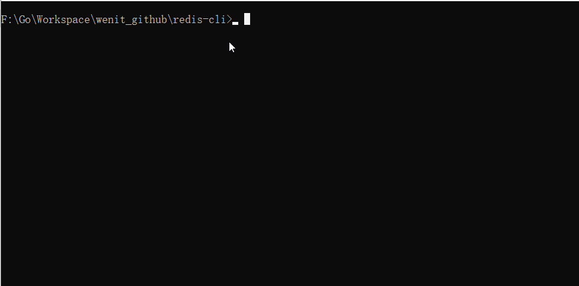

## 初始化命令行参数

我们使用flag包进行命令参数的解析

``` go
var host string
var port int

func init() {
	flag.StringVar(&host, "h", "localhost", "host")
	flag.IntVar(&port, "p", 6379, "port")
}


func main() {
	// 解析命令行参数
	flag.Parse()
 
    // ...
}
```


## 命令行输入

``` go
func loop(conn net.Conn) {
	for {
		fmt.Printf("%s:%d>", host, port)
		bio := bufio.NewReader(os.Stdin)
		input, _, err := bio.ReadLine()
		if err != nil {
			log.Fatal(err)
		}
		fmt.Printf("%s\n", input)
	}
}
```


## 创建连接

``` go
// 创建链接
func NewConn() net.Conn {

	addr := &net.TCPAddr{IP: net.ParseIP(host), Port: port}
	conn, err := net.DialTCP("tcp", nil, addr)

	if err != nil {
		log.Fatal("初始化链接失败：", err)
	}

	return conn
}
```


## 预览效果

